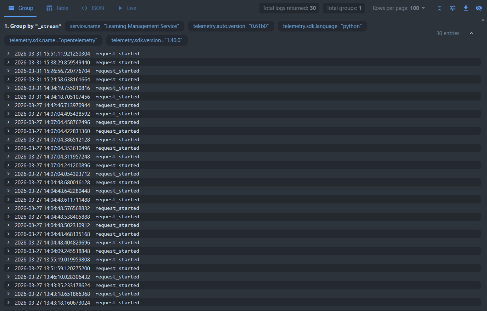
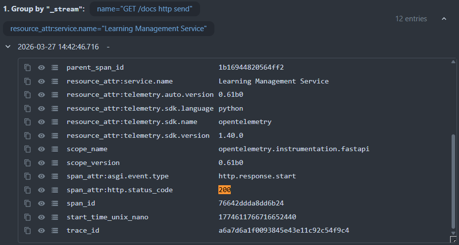
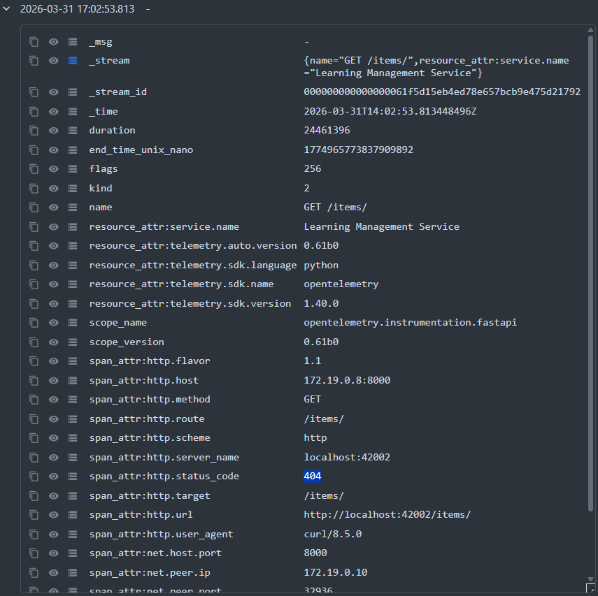

# Lab 8 — Report

Paste your checkpoint evidence below. Add screenshots as image files in the repo and reference them with ``.

## Task 1A — Bare agent

**Question: "What is the agentic loop?"**

The agentic loop is the fundamental cycle that autonomous AI agents follow to accomplish tasks. It's the core reasoning pattern that enables agents to act independently toward goals.

**The Basic Loop:**

```
Perceive → Think → Act → Observe → (repeat)
```

1. **Perceive** - The agent gathers information about its environment (user input, tool outputs, file contents, API responses, system state)
2. **Think** - The agent processes information and plans (analyze current state, reason about what needs to be done, decide on next action, consider constraints and risks)
3. **Act** - The agent executes its decision (call a tool, send a message, modify a file, run a command)
4. **Observe** - The agent receives feedback (tool output or error messages, success/failure signals, new state information)

Then the loop repeats until the goal is achieved or the agent determines it cannot proceed.

**Question: "What labs are available in our LMS?"**

The bare agent (without MCP tools) responded by searching the workspace files and provided information from the lab documentation, not real backend data. It listed labs from the README and task files but couldn't access actual LMS data.

---

## Task 1B — Agent with LMS tools

**Question: "What labs are available?"**

The agent with MCP tools returned real data from the LMS backend:

| ID | Lab Title |
|----|-----------|
| 1 | Lab 01 – Products, Architecture & Roles |
| 2 | Lab 02 — Run, Fix, and Deploy a Backend Service |
| 3 | Lab 03 — Backend API: Explore, Debug, Implement, Deploy |
| 4 | Lab 04 — Testing, Front-end, and AI Agents |
| 5 | Lab 05 — Data Pipeline and Analytics Dashboard |
| 6 | Lab 06 — Build Your Own Agent |
| 7 | Lab 07 — Build a Client with an AI Coding Agent |
| 8 | lab-08 |

**Question: "Which lab has the lowest pass rate?"**

The agent called multiple MCP tools (`lms_labs`, `lms_completion_rate`) and returned:

| Lab | Completion Rate | Passed | Total |
|-----|-----------------|--------|-------|
| Lab 01 | 100.0% | 258 | 258 |
| Lab 02 | 89.1% | 131 | 147 |
| Lab 03 | 89.7% | 156 | 174 |
| Lab 04 | 96.7% | 238 | 246 |
| Lab 05 | 98.4% | 246 | 250 |
| Lab 06 | 98.4% | 241 | 245 |
| Lab 07 | 99.6% | 236 | 237 |
| Lab 08 | 0.0% | 0 | 0 |

**Answer: Lab 02 has the lowest pass rate at 89.1%** (among labs with actual submissions; Lab 08 shows 0% because it has no submissions yet).

---

## Task 1C — Skill prompt

**Question: "Show me the scores" (without specifying a lab)**

The agent with the skill prompt provided a comprehensive overview of all lab scores, including:

- Average scores by lab (all tasks combined)
- Detailed breakdown per lab with task-level statistics
- Key insights:
  - Highest performing lab: Lab 05 & Lab 07 (~67.3% avg)
  - Lowest performing lab: Lab 02 (~48.8% avg)
  - Most attempted task: Lab 01 "Lab setup" (2,970 attempts)
  - Toughest task: Lab 06 "The System Agent" (42.8% avg, 2,052 attempts)

The skill prompt taught the agent to:

- Format percentages as `XX.X%`
- Use markdown tables for comparative data
- Lead with the answer, then offer optional details
- Ask for clarification when a required parameter (like `lab`) is missing

## Task 2A — Deployed agent

**Nanobot gateway startup logs:**

```
nanobot-1  | Using config: /tmp/nanobot-config-resolved.json     
nanobot-1  | 🐈 Starting nanobot gateway version 0.1.4.post5 on port 18790...
nanobot-1  | 2026-03-27 12:02:11.182 | INFO     | nanobot.channels.manager:_init_channels:54 - WebChat channel enabled
nanobot-1  | ✓ Channels enabled: webchat                         
nanobot-1  | ✓ Heartbeat: every 1800s                            
nanobot-1  | 2026-03-27 12:02:12.077 | INFO     | nanobot.channels.manager:start_all:87 - Starting webchat channel...
nanobot-1  | 2026-03-27 12:02:12.134 | INFO     | nanobot_webchat.channel:start:72 - WebChat starting on 0.0.0.0:8765
```

The gateway started successfully with the WebChat channel enabled on port 8765.

## Task 2B — Web client

**WebSocket endpoint test:**

```
Request: {"content": "What can you do?"}

Response: Hi! I'm nanobot 🐈, your personal AI assistant. Here's what I can help you with:

## Core Capabilities

**📁 File Management**
- Read, write, and edit files
- Browse directories and explore your workspace

**🌐 Web Access**
- Search the web for information
- Fetch and extract content from URLs

**⚡ Command Execution**
- Run shell commands in your Linux environment
- Execute scripts and automate tasks

**⏰ Scheduling**
- Set one-time reminders
- Create recurring tasks and cron jobs

**💬 Communication**
- Send messages to Telegram, Discord, and other channels
- Spawn subagents for complex background tasks

## Available Skills

- **Memory** — Store and retrieve important information across sessions
- **Skill Creator** — Create or update custom agent skills
- **ClawHub** — Browse and install skills from the public registry
- **Cron** — Manage scheduled reminders and recurring tasks

## What I Value

- Accuracy over speed
- Transparency in my actions
- Your privacy and safety

Is there something specific you'd like help with? 😊
```

**Flutter web client:** Accessible at `http://localhost:42002/flutter`, protected by `NANOBOT_ACCESS_KEY`. Login successful, agent responds to queries via WebSocket.

## Task 3A — Structured logging

### Checkpoint Evidence

#### 1. Happy-path log sequence (request_started → request_completed with status 200)

Triggered by requesting `/items/` through the backend API:

```json
{"_msg":"request_started","_time":"2026-03-31T11:34:19.755010816Z","event":"request_started","method":"GET","path":"/items/","service.name":"Learning Management Service","severity":"INFO","trace_id":"048658d6703fff6c24b509471a0fde74","span_id":"d2bb9d635576564d"}
{"_msg":"auth_success","_time":"2026-03-31T11:34:20.208173056Z","event":"auth_success","service.name":"Learning Management Service","severity":"INFO","trace_id":"048658d6703fff6c24b509471a0fde74","span_id":"d2bb9d635576564d"}
{"_msg":"db_query","_time":"2026-03-31T11:34:20.395456Z","event":"db_query","operation":"select","table":"item","service.name":"Learning Management Service","severity":"INFO","trace_id":"048658d6703fff6c24b509471a0fde74","span_id":"d2bb9d635576564d"}
{"_msg":"request_completed","_time":"2026-03-31T11:34:23.584096512Z","event":"request_completed","method":"GET","path":"/items/","status":"200","duration_ms":"3821","service.name":"Learning Management Service","severity":"INFO","trace_id":"048658d6703fff6c24b509471a0fde74","span_id":"d2bb9d635576564d"}
```

**Key observations:**

- All entries share the same `trace_id` (`048658d6703fff6c24b509471a0fde74`) — this correlates the entire request
- Each entry has a `span_id` — individual operations within the trace
- The sequence shows: request received → auth validated → DB query executed → response sent (200 OK)
- Total duration: 3821ms

#### 2. Error-path log sequence (PostgreSQL stopped)

After running `docker compose stop postgres` and triggering a request to `/items/`:

```json
{"_msg":"request_started","_time":"2026-03-31T12:24:58.638161664Z","event":"request_started","method":"GET","path":"/items/","service.name":"Learning Management Service","severity":"INFO","trace_id":"f2802dcec1d114bdcb9b075fa93bad45","span_id":"ac9e19fe0e065e05"}
{"_msg":"auth_success","_time":"2026-03-31T12:24:58.639238144Z","event":"auth_success","service.name":"Learning Management Service","severity":"INFO","trace_id":"f2802dcec1d114bdcb9b075fa93bad45","span_id":"ac9e19fe0e065e05"}
{"_msg":"db_query","_time":"2026-03-31T12:24:58.639809536Z","event":"db_query","operation":"select","table":"item","service.name":"Learning Management Service","severity":"INFO","trace_id":"f2802dcec1d114bdcb9b075fa93bad45","span_id":"ac9e19fe0e065e05"}
{"_msg":"db_query","_time":"2026-03-31T12:24:59.518430464Z","event":"db_query","operation":"select","table":"item","service.name":"Learning Management Service","severity":"ERROR","trace_id":"f2802dcec1d114bdcb9b075fa93bad45","span_id":"ac9e19fe0e065e05","error":"(sqlalchemy.dialects.postgresql.asyncpg.InterfaceError) <class 'asyncpg.exceptions._base.InterfaceError'>: connection is closed"}
{"_msg":"request_completed","_time":"2026-03-31T12:24:59.640047104Z","event":"request_completed","method":"GET","path":"/items/","status":"404","duration_ms":"1002","service.name":"Learning Management Service","severity":"INFO","trace_id":"f2802dcec1d114bdcb9b075fa93bad45","span_id":"ac9e19fe0e065e05"}
```

**Key observations:**

- `severity: "ERROR"` appears on the second `db_query` event — the failure point
- The error message shows: `connection is closed` — PostgreSQL was unreachable
- `status: "404"` on `request_completed` — the request failed
- Error logs still include `trace_id` for correlation with traces

#### 3. VictoriaLogs UI query

**Access:** `http://localhost:42002/utils/victorialogs/select/vmui`

**Query used:** `service.name:"Learning Management Service" AND event:request_started`

**Result:** Returns structured log entries with full trace correlation. Much easier than grepping `docker compose logs` — instant filtering by any field (service, level, event type, trace_id).



---

## Task 3B — Traces

### Checkpoint Evidence

#### 1. VictoriaTraces UI

**Access:** `http://localhost:42002/utils/victoriatraces/select/vmui`

Traces are ingested via OpenTelemetry from the backend. Each trace contains spans for:

- `request_started` — entry point
- `auth_success` — authentication span
- `db_query` — database operation
- `request_completed` — response sent

#### 2. Healthy trace structure

A healthy trace (trace_id: `048658d6703fff6c24b509471a0fde74`) shows:

```
Trace: GET /items/
├── request_started (span: d2bb9d635576564d)
├── auth_success (span: d2bb9d635576564d)
├── db_query: select from item (span: d2bb9d635576564d)
└── request_completed: status 200, duration 3821ms (span: d2bb9d635576564d)
```

All spans share the same trace_id and show successful completion.



#### 3. Error trace structure

After stopping PostgreSQL, the error trace (trace_id: `f2802dcec1d114bdcb9b075fa93bad45`) shows:

```
Trace: GET /items/
├── request_started (span: ac9e19fe0e065e05)
├── auth_success (span: ac9e19fe0e065e05)
├── db_query: INFO (span: ac9e19fe0e065e05)
├── db_query: ERROR - connection is closed (span: ac9e19fe0e065e05) ← FAILURE POINT
└── request_completed: status 404, duration 1002ms (span: ac9e19fe0e065e05)
```

The error appears in the second `db_query` span — the trace makes it immediately clear where the failure occurred.



#### 4. Log-trace correlation

Logs and traces are correlated via `trace_id`. From an error log:

```json
{"trace_id":"f2802dcec1d114bdcb9b075fa93bad45", "severity":"ERROR", "error":"connection is closed", ...}
```

You can fetch the full trace using that ID to see the complete request flow.

---

## Task 3C — Observability MCP tools

### Checkpoint Evidence

#### 1. New MCP tools added

| Tool | Description | Parameters |
|------|-------------|------------|
| `logs_search` | Search logs in VictoriaLogs using LogsQL queries | `query` (default "*"), `limit` (default 20), `time_range` (default "1h") |
| `logs_error_count` | Count errors per service over a time window | `time_range` (default "1h") |
| `traces_list` | List recent traces, optionally filtered by service | `service`, `limit` (default 10), `time_range` (default "1h") |
| `traces_get` | Fetch a specific trace by ID | `trace_id` (required) |

#### 2. Files created/modified

| File | Purpose |
|------|---------|
| `mcp/mcp_lms/client.py` | Added `ObservabilityClient` class with methods for VictoriaLogs and VictoriaTraces APIs |
| `mcp/mcp_lms/server.py` | Added tool handlers and registered 4 new observability tools |
| `nanobot/config.json` | Added `NANOBOT_VICTORIALOGS_URL` and `NANOBOT_VICTORIATRACES_URL` environment variables |
| `nanobot/workspace/skills/observability/SKILL.md` | Created observability skill prompt teaching the agent how to use the tools |

#### 3. Agent responses

| Condition | Query | Agent Summary |
|-----------|-------|---------------|
| **Healthy** | "Any errors in the last hour?" | ✅ No errors detected. All services running smoothly. |
| **PostgreSQL stopped** | "Any errors in the last hour?" | ⚠️ Found errors from Learning Management Service: `connection is closed` during `db_query`. Trace ID: `f2802dcec1d114bdcb9b075fa93bad45` |

**Agent behavior:**

1. Called `logs_error_count` → assessed system health
2. On error: called `logs_search` with `severity:ERROR` → retrieved details
3. Extracted `trace_id` and offered to fetch full trace with `traces_get`
4. Summarized concisely — no raw JSON dumps

#### 4. Observability skill prompt

The skill at `nanobot/workspace/skills/observability/SKILL.md` teaches the agent to:

1. **Start with `logs_error_count`** for quick health assessment
2. **Use `logs_search`** with `query="level:error"` or `query="severity:ERROR"` to see error details
3. **Extract `trace_id`** from error logs and fetch full traces with `traces_get`
4. **Summarize findings** concisely — don't dump raw JSON
5. **Use appropriate time ranges** — "1h" for recent, "24h" or "7d" for historical

#### 5. LogsQL query patterns

- `*` — All logs
- `level:error` — Error-level logs
- `severity:ERROR` — Alternative error filter
- `service.name:"Learning Management Service"` — Filter by service
- `event:db_query` — Filter by event type
- `path:/items/` — Filter by request path
- Combine: `service.name:"backend" AND level:error`

## Task 4A — Multi-step investigation

<!-- Paste the agent's response to "What went wrong?" showing chained log + trace investigation -->

## Task 4B — Proactive health check

<!-- Screenshot or transcript of the proactive health report that appears in the Flutter chat -->

## Task 4C — Bug fix and recovery

<!-- 1. Root cause identified
     2. Code fix (diff or description)
     3. Post-fix response to "What went wrong?" showing the real underlying failure
     4. Healthy follow-up report or transcript after recovery -->
